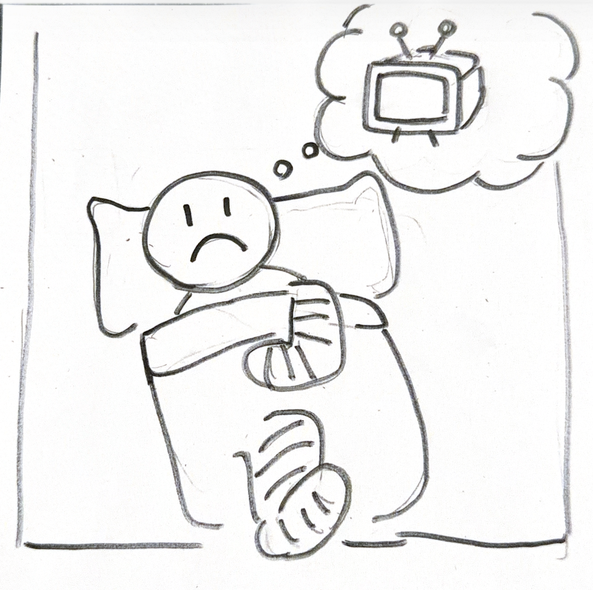
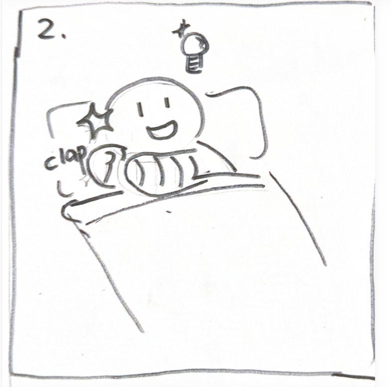
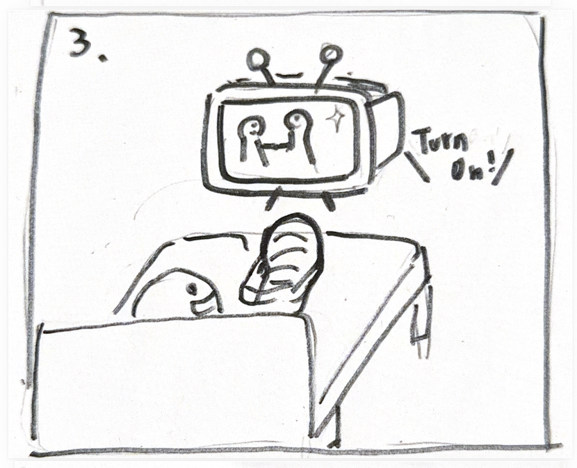
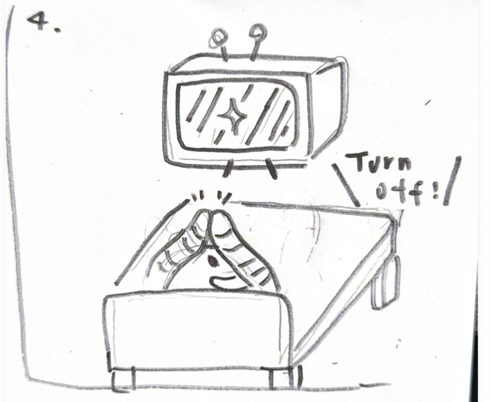
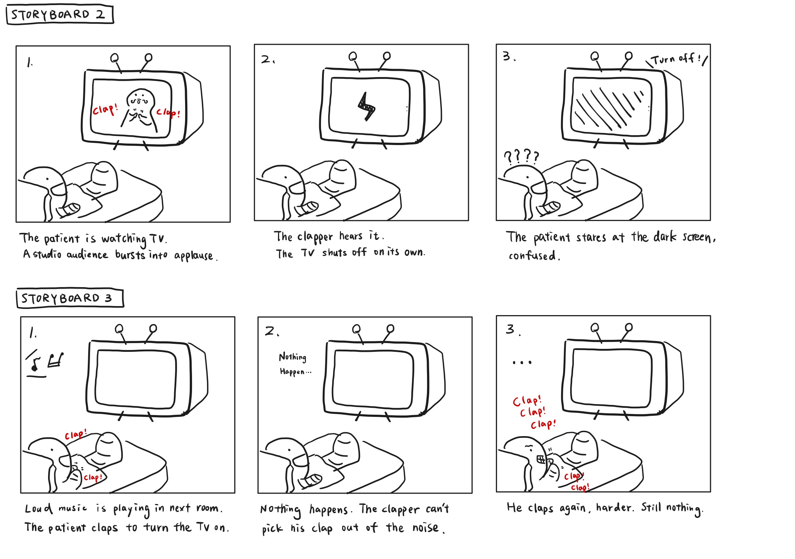
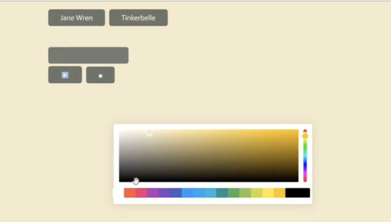
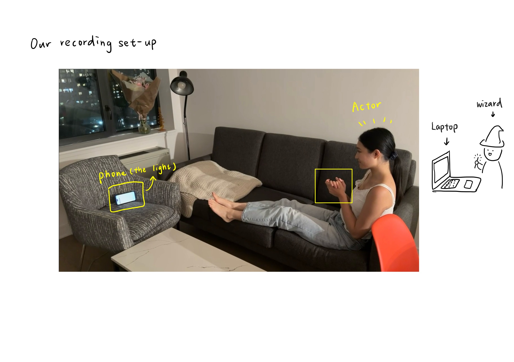
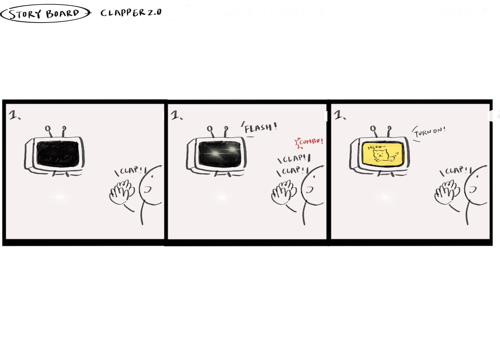
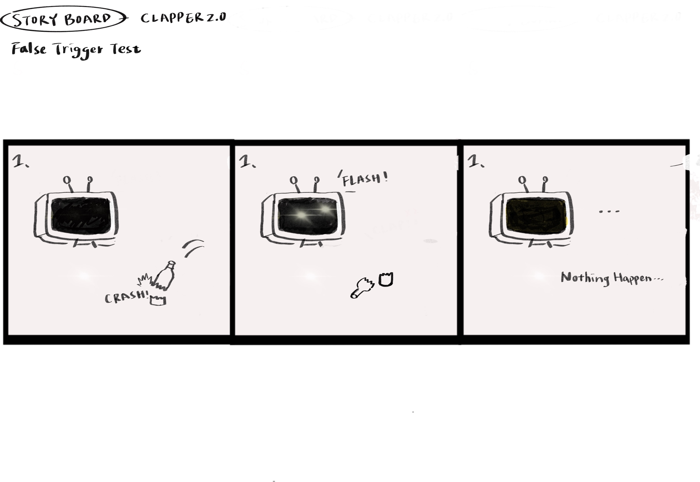

# Recreating the Masters of Interactive Light

_This project is to be done in teams of 2._

**NAME OF BOTH COLLABORATOR(S) HERE**
Jacey Hu(ch2296), Serena Tsai(ht534)

**THE MASTERWORK YOU DREW FROM THE HAT:**
The Clapper, Joseph Enterprises, 1985.
---

One way to understand greatness is to look to the greats. Just as painters learn
the technique and artistry of the old masters by recreating their paintings, so
too shall we come to understand computer-mediated interaction by recreating the
interactive masterworks of our time.

This week, every team will draw a different masterwork from a hat. Some are
conceptual pieces, some are historical works, some are modern-day products —
but they all share one thing: **their central mode of interaction is carried by
light.** Think of Tinker Bell in the original stage production of *Peter Pan*,
represented by nothing more than a darting circle of light from an off-stage
mirror. There was no actor playing Tinker Bell; she existed entirely through the
way the other characters interacted with that light.

Your job is to recreate the *interaction* of the piece you drew — not to build a
museum-grade replica, but to stage the moment that makes it what it is. Someone
who knows your piece should watch your recreation and recognize it instantly.
Someone who has never heard of it should walk away understanding what it is
famous for.

You will do this using the interaction staging techniques we will use all semester: a
storyboard, some acting, a phone standing in as a controllable light (the
*Tinkerbelle* tool), a hidden human "wizard" driving it, a costume, and a
recorded video.

*Make sure you read all the instructions and understand the whole activity
before starting!*

## Prep

To start, you will need:

1. Read about Git [here](https://git-scm.com/book/en/v2/Getting-Started-What-is-Git%3F).
2. Set up your own Github "Lab Hub" by forking the [Interactive-Lab-Hub repository](https://github.com/IRL-CT/Interactive-Lab-Hub). To get lab updates, simply use [GitHub's "Sync fork" button](https://docs.github.com/en/pull-requests/collaborating-with-pull-requests/working-with-forks/syncing-a-fork) when new content is available.

3. Set up your `README.md` so it has your name and links to this lab. Learn to
   format a README [here](https://docs.github.com/en/get-started/writing-on-github/getting-started-with-writing-and-formatting-on-github/basic-writing-and-formatting-syntax).
4. **Draw your masterwork from the hat and write it at the top of this file.**
   Whatever you drew is yours — lean into it.

## Materials

For this lab you will need:

1. Paper, markers/pens, scissors
2. A smartphone with a browser that can display a webpage (your stand-in "light")
3. A computer to host the control webpage
4. Found objects and materials to **costume your phone so it looks like the
   device in your masterwork** — doll clothes, a paper lantern, a bottle, foil,
   a cardboard shell, whatever it takes. Be resourceful.

## Deliverables

Submit all of the following in this lab folder of your Lab Hub, as links or
uploaded files. **Each group member posts their own copy to their own Github repo**, even if the work is
shared.

1. A short **research write-up** of your masterwork (what it is, when, who made
   it, and — most importantly — what the interaction is)
2. **3 iterated storyboards** of the interaction in the masterwork
5. A **video sketch** of your prototyped interaction
6. Any **reflections** on the process

Labs are due on Mondays. Make sure this page is linked from your main class hub
page.

---

# The Report

## Part 0. Know Your Master

Before you prototype anything, get intimately acquainted with the piece you
drew. Do real research. You are looking less for trivia than for the *shape of
the interaction*:

- What inputs are available to the user? What responses does the work give?
- Who is present, and how does the piece color the relationships between them?
- What is the piece famous for? What are its strengths and its weaknesses?

  Sometimes the details of how the interaction worked are lost in history. Try filling it in with your imagination!

**Describe your masterwork here, in your own words. What is the core interaction
someone would recognize it by?**

My masterwork: The Clapper, Joseph Enterprises, 1985.
The Clapper is a sound-activated switch that lets users turn an appliance on or off without walking over to the outlet or pressing any button.

- What inputs are available to the user? What responses does the work give?

The input is a clap, or any sound that resembles a clap. The response can take several forms, the most common being a light turning on or off.

- Who is present, and how does the piece color the relationships between them?

In the commercial for this product, an older woman who is already in bed claps to turn off a warm yellow lamp and the television. It changes the relationship between a person and their room: she no longer has to get out of bed to reach the switch, and she has more control over the space from where she is.

## Part A. Plan

For your masterwork, reconstruct the interaction as a scene:

- **Setting:** Where and when does this interaction happen? (a jungle, a kitchen,
  a spaceship corridor, a nightclub, a harbor at night)
- **Players:** Who is involved? Who else is present? Think through everyone in
  the setting, not just the primary user.
- **Activity:** What is happening between the players and the light?
- **Goals:** What is each player trying to do?

**Describe your setting, players, activity, and goals here.**
- **Setting:** A hospital room in the late evening. There is one patient in bed with a broken leg, a large TV in front of him, and a lamp beside him.
- **Players:** A patient whose leg is in a cast. He cannot get out of bed.
- **Activity:** The patient wants to turn the TV on.
- **Goals:** The patient wants to watch TV without calling a nurse, and to keep some independence over his own room.

Now **sketch a 3 storyboards** of the interaction you are recreating. (The number may depend on the thing you drew, but stretch your thinking!) They
don't need to be beautiful, but they must capture and communicate not only the behavior of the light, but how it affects
and the people around it. If you're new to storyboarding, read
[this explanation](https://www.nngroup.com/articles/storyboards-visualize-ideas/).

**Include pictures of your storyboards here.**  

  
  
  

1. Late evening in a hospital room. The patient wants to watch TV, but his leg is in a cast and he can't get out of bed to reach it.
2. He claps twice from where he is. The TV lights up!
3. He settles back and watches, without ever calling a nurse.

Use the storyboards to decide what interaction to prototype.

**Summarize the feedback you got here.**

## Part B. Act out the Interaction

Physically act out the interaction you planned. For now, just pretend the light
is doing what you've scripted — a person can wave a flashlight, or you can narrate
it aloud.

**Are there things that seemed better on paper than when acted out?**  
Yes. Once we acted out the scene from our storyboard, we realized we had never decided how to turn the TV off. Should it use the same trigger as turning it on? We added a fourth storyboard to show the full cycle: the TV can be both turned on and turned off by clapping.
**Did new ideas about the piece surface once you were on your feet?**  
After acting it out, we realized the Clapper gives users more control over their own space, which is what makes it a strong design. Beyond convenience, it also opens up a way for people with limited mobility to interact with a room they can't physically move around in.
**Are there key moments in the interaction where things could go in a different direction?**  
Iterate your storyboards to capture key non-sequential aspects of the interaction.  
There are two moments where the interaction can break down. The first is the pause after a clap: if the light doesn't respond quickly enough, the user gets impatient and claps again, which turns the TV back off right as it comes on. How long is too long? The second is a false trigger: a cough, a knock at the door, or even applause from the TV itself could be mistaken for a clap.

We went back and added Storyboards 2 and 3 to capture these two failure paths, one where the room listens too well, and one where it doesn't listen at all.

## Part C. Prototype the Light (light first!)

Use your smartphone as the light of your device. Open the browser on your phone
to act as the "light," and use the remote control interface on your computer to
change that light. Code and setup instructions for the *Tinkerbelle* tool are
[here](https://github.com/IRL-CT/tinkerbelle) (we invented this tool for
this lab). If you hit technical trouble, a manually or remotely controlled light
switch, dimmer, or lamp is a fine substitute.  
  
We used only two states: black for the TV being off, and a pale yellow for the
TV being on. The pale yellow stands in for the glow a screen throws into a dark
room, which is what the patient actually sees from his bed at night, he doesn't
look at the TV so much as he notices the room change color. We left about a
one-second delay between the clap and the switch, so the light feels like it is
responding to him rather than reading his mind. That delay also turned out to be
the exact gap that makes a user wonder whether the device heard them at all.

**Get the light interaction working before anything else.** Your grade this week
rides on the *light* being recognizable — the color, the rhythm, the timing, the
way it answers a person. Only once your light interaction genuinely reads as your
masterwork should you consider layering in a second modality (sound, vibration,
motion). If in doubt, keep polishing the light. The other modalities are next
week's business.

## Part D. Wizard the Device

Set up a "wizard" arrangement so one person can secretly drive the light while
another acts with it — this is how you make the device feel alive without
building any real electronics. (Zoom works well for recording; you can pin the
video feed of whichever scene you want to capture.)
**Include your first attempts at recording the wizarded set-up here.**  
  
The wizard stood behind the couch, out of frame. She couldn't see the actor's
hands from there, but she could hear the clap clearly, and switched the light
the moment she heard it. Listening turned out to be enough, the Clapper responds
to sound, so the wizard was doing exactly what the real device would do.
The main problem we ran into was filming. With one person acting and one person
wizarding, there was nobody left to hold the camera, so we had to ask a third
person to shoot for us in order to get the whole room in frame.

## Part E. (optional) Costume the Device

Only now should you worry about what the device looks like. Costume your phone so it reads
as the object from your masterwork — HAL's eye, a Simon shell, a paper-lantern
Tinker Bell, an Ambient Orb, a lighthouse, a jack-o'-lantern, whatever you drew.

Think about the world your device lives in: could that environment overheat it?
Is water a danger? Does it need to be loud and bright for an emergency, or quiet
and calm for a bedroom?

**Include sketches/photos of what your device might look like here.**

**What concerns or opportunities shaped the way you designed its look?**

## Part F. Record

**Record your prototyped interaction as a video sketch.** Aim for the bar from
the top of this lab: a viewer who knows the piece should recognize it; a viewer
who doesn't should come away understanding what it's famous for. How might you illustrate the non-sequential aspects of the interaction in the sketch?  
**Include your video here.**
Video Link :https://drive.google.com/file/d/1sz4cS_P7qScJjlgcyHWM9oJqxtC2AbK6/view?usp=sharing  

**Please indicate who you collaborated with on this lab.** Be generous in
acknowledging their contributions, and credit any other influences (YouTube,
Github, Twitter, a friend who lent you a lamp) that informed your recreation.

I worked on this lab with Serena Tsai (ht534). We developed the concept together.
Serena set up Tinkerbelle and played the patient on camera, I storyboarded the scene, planned the shots, and drove the light as the wizard. We referenced the original Clapper commercial for the pacing of the clap and the way the light
answers it.

---

# Part 2 — ReMastering the light

*This describes the second week's work for this lab activity.*

## Prep (before the next lab)

Find three other groups. (How? Maybe Slack?) Visit their Lab Hub pages, watch their
videos, and give them reactions and feedback: tell them what you saw happening,
guess the masterwork and the goals of the characters, and ask about anything that
wasn't clear.

**Who were the other groups you kibitzed with? Add links to their project pages here.**

**Summarize the feedback you got from your partners here.**
Find three other groups. (How? Maybe Slack?) Visit their Lab Hub pages, watch their videos, and give them reactions and feedback: tell them what you saw happening, guess the masterwork and the goals of the characters, and ask about anything that wasn't clear.

Who were the other groups you kibitzed with? Add links to their project pages here. Summarize the feedback you got from your partners here. Group 1 (Light-Up Sneakers: Jonathan Sharpy, Gal Alon)

project link: https://github.com/jjs564-gif/Interactive-Lab-Hub/tree/Fall2026/Lab%201

feedback: The interactive light display is titled “the clapper”, which utilizes the sound generated by clapping to power devices on/off. In the video, the user is lying comfortably on a couch with a phone, representing a TV, located in front of and away from her. The user claps twice to turn the device on (represented by a transition to a white screen), allows it to stay on for a few seconds, then claps twice again to shut the device off (represented by a transition to a black screen). The video makes it clear how this device makes the interaction between user and a distant device or appliance extremely simple and convenient.

Group 2 (Brake & Turn Signals: Xiaoxi Xu)

project link: https://github.com/xuxx21/Interactive-Lab-Hub/tree/5dbb2499de886b145aefa204217daf146b7c2972/Lab%201

feedback: I think your interaction is really straightforward and clear! I also really like your first storyboard：） I just had one small question: why did you choose to control the TV instead of the room lights, （especially since you also mentioned some possible weaknesses with that choice） The first scenario that came to my mind was lying in bed and not wanting to get up to turn the lights off before going to sleep haha. Since the interaction is based on clapping, I also wonder if you could show a few more variations of the interaction, like one clap, multiple claps in a row, or fast clapping, and see how the system responds differently to each.

Group 3 (The Hand from Above: Edmond Kong)

project link: https://github.com/edmkong/Interactive-Lab-Hub

feedback: For the last frame of storyboard 3, I am not sure if the clapper is broken because loud music was playing or if it is already broken without loud music playing. The last frame makes it seem like there is no music playing and the patient’s claps aren’t being recognized.

I like how the TV is drawn to show different actions, as well as the red text.

I also think the video is well made and communicates the intention of the Clapper
## Remix, Update, or Critique the Master

Now that you understand your masterwork from the inside, respond to it. Do the
recreation again, but this time make it your own — pick one of these moves (or
combine them):

1. **Remix the modality.** Your recreation no longer has to (just) use light. Use
   vibration, sound, motion, heat — whatever best carries the interaction. Feel
   free to fork and modify the Tinkerbelle code. (Add your updates to this lab's folder!)
2. **Update it.** Redesign the piece for today's context, or for a setting its
   creators never imagined (the piece with roommates in the room, with children
   present, on a phone, in a car).
3. **Fix its weaknesses.** You identified this master's strengths and weaknesses
   in Part 0 — now address a weakness, or push a strength further.

We will grade this second pass with an emphasis on **creativity** and on how well
your response engages with what your master was really doing.

**Document everything here — especially the storyboard and video. Photos of the
prototype are great too.**

---
### Clapper 2.0 — Confirm Before Action
Problem:
One of the main weaknesses we identified in the original Clapper is false triggering. Because the system responds to sounds that resemble claps, sounds from a television, music, or other people could unintentionally activate a connected device.

Redesign:
For Clapper 2.0, we added a confirmation step while keeping clapping as the core interaction: Clap pattern → Light flashes → Clap to confirm → Action Instead of immediately changing the device state, the light briefly flashes to acknowledge the command. The user then claps again to confirm before the device turns on or off.

Why It Works:
This redesign preserves the simplicity of the original Clapper while making accidental activation less likely. It also gives light a new role: instead of only showing the final ON/OFF state, light now communicates that the system has heard the user and is waiting for confirmation.

### Storyboards
Clapper2.0 
 
Clapper2.0 - False Trigger Prevention 
 

### Video
[Watch: Clapper 2.0 Interaction] https://drive.google.com/file/d/1SYpLbNUh-MJKiEAYQ8EolPlnPW2BPXfz/view?usp=drive_link 
[Watch: False Trigger Test] https://drive.google.com/file/d/1lMZ--x6HPxzJu98SQgj0Xz-qF_sWi6e3/view?usp=drive_link

*Assignment lineage: this lab merges "Staging Interaction" (Interactive Lab Hub)
with "Recreating the Masters" (Interaction Design Studio, Profs. Scott Minneman &
Wendy Ju). Massive list of interactive light masterworks generated by Claude.ai.*
