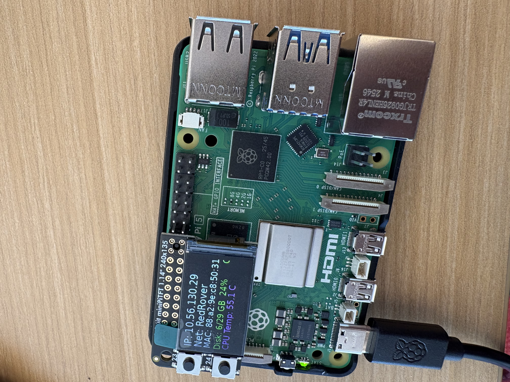
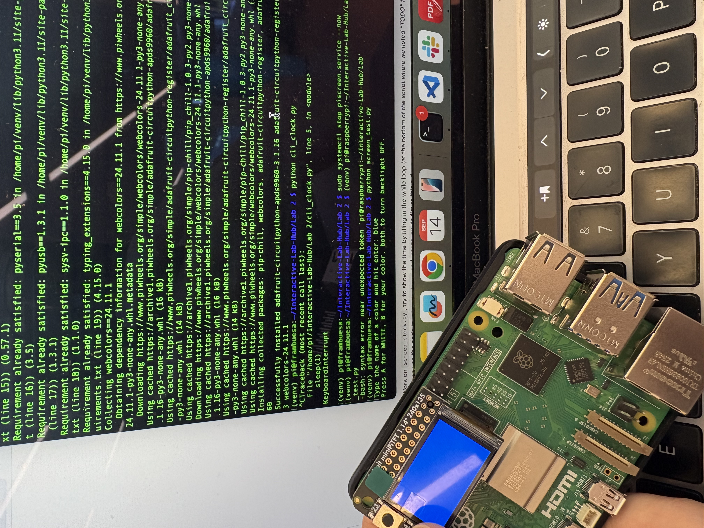
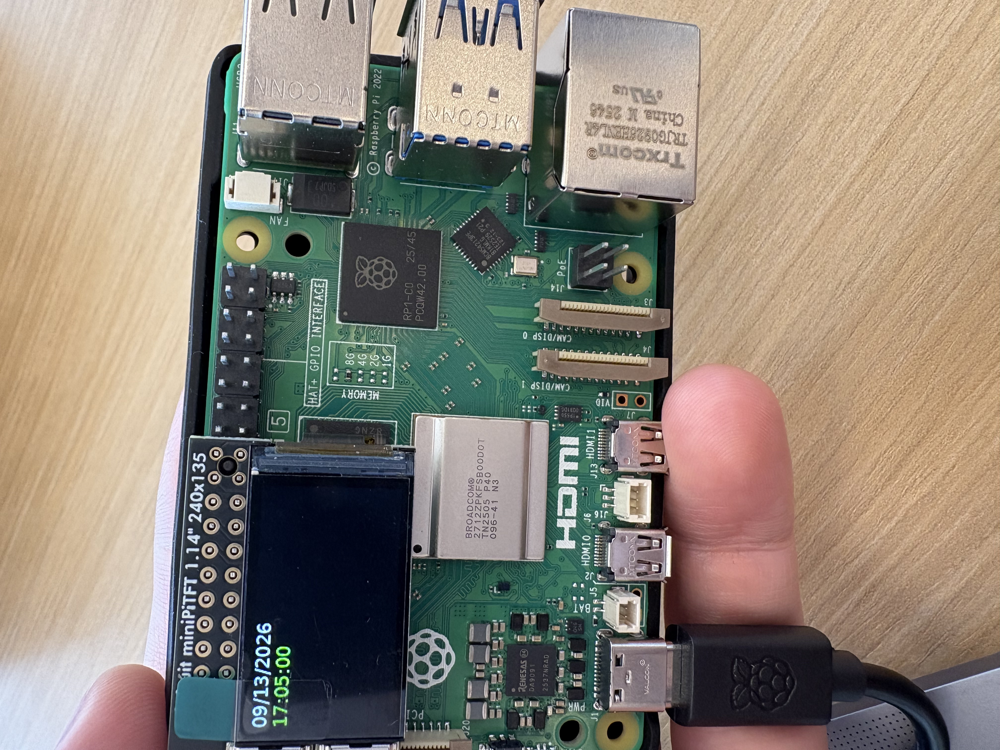
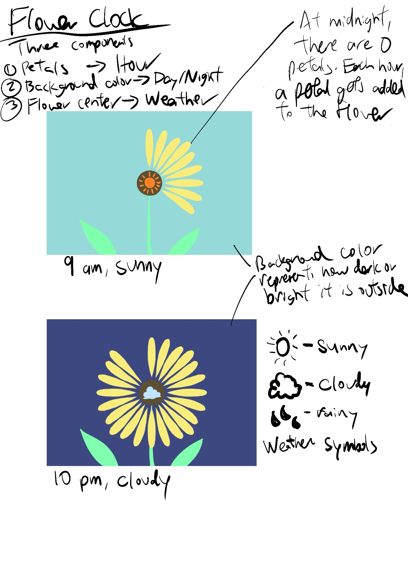
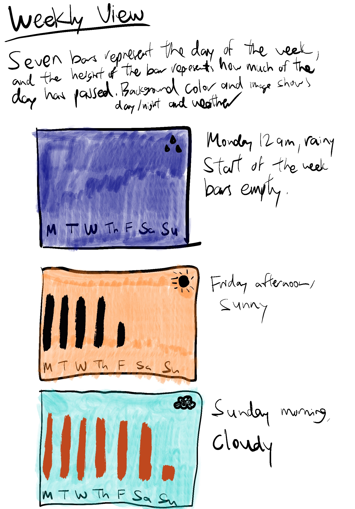
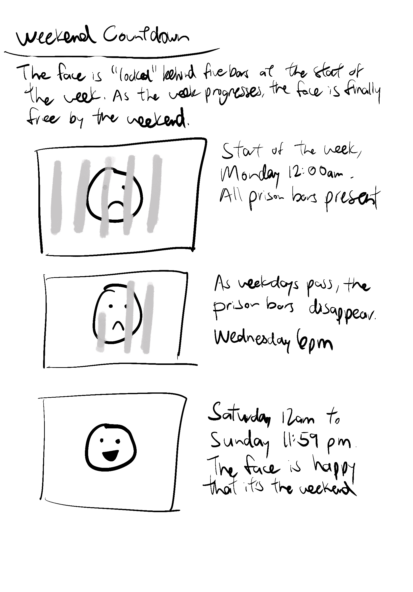

# Interactive Prototyping: The Clock of Pi

**NAMES OF COLLABORATORS HERE**

- Edmond Kong (eck67)
- Gabriela Yaulli Herrera (cgy4)
- Jacey Hu (ch2296)

Does it feel like time is moving strangely during this semester?

For our first Pi project, we will pay homage to the [timekeeping devices of old](https://en.wikipedia.org/wiki/History_of_timekeeping_devices) by making simple clocks.

It is worth spending a little time thinking about how you mark time, and what would be useful in a clock of your own design.

**Please indicate anyone you collaborated with on this Lab here.**
Be generous in acknowledging their contributions! And also recognizing any other influences (e.g. from YouTube, Github, Twitter) that informed your design. 

## Prep

1. ### Set up your Lab 2 Github

At the start of lab Wednesday, ensure you have the latest lab content by updating your forked repository. 

**📖 [Follow the step-by-step guide for safely updating your fork](pull_updates/README.md)**

This guide covers how to pull updates without overwriting your completed work, handle merge conflicts, and recover if something goes wrong.


2. ### Get Kit and Inventory Parts
Take inventory of the kit parts that you have, and note anything that is missing:

***Update your [parts list inventory](partslist.md)***

3. ### Prepare your Pi for lab this week
[Follow these instructions](prep.md) to download and burn the image for your Raspberry Pi before lab Wednesday.


## Overview
For this assignment, you are going to 

A) [Connect to your Pi](#part-a)  

B) [Try out cli_clock.py](#part-b) 

C) [Set up your RGB display](#part-c)

D) [Try out clock_display_demo](#part-d) 

E) [Modify the code to make the display your own](#part-e)

F) [Make a short video of your modified barebones PiClock](#part-f)

G) [Sketch and brainstorm further interactions and features you would like for your clock for Part 2.](#part-g)

## The Report
This readme.md page in your own repository should be edited to include the work you have done. You can delete everything but the headers and the sections between the \*\*\***stars**\*\*\*. Write the answers to the questions under the starred sentences. Include any material that explains what you did in this lab hub folder, and link it in the readme.

Labs are due on Sunday midnight. Make sure this page is linked to on your main class hub page.

## Part A. 
### Connect to your Pi
Just like you did in the lab prep, ssh on to your pi. Once you get there, create a Python environment (named venv) by typing the following commands.

```
ssh pi@<your Pi's IP address>
...
pi@raspberrypi:~ $ python -m venv venv
pi@raspberrypi:~ $ source venv/bin/activate
(venv) pi@raspberrypi:~ $ 

```
### Setup Personal Access Tokens on GitHub
Set your git name and email so that commits appear under your name.
```
git config --global user.name "Your Name"
git config --global user.email "yourNetID@cornell.edu"
```

The support for password authentication of GitHub was removed on August 13, 2021. That is, in order to link and sync your own lab-hub repo with your Pi, you will have to set up a "Personal Access Tokens" to act as the password for your GitHub account on your Pi when using git command, such as `git clone` and `git push`.

Following the steps listed [here](https://docs.github.com/en/authentication/keeping-your-account-and-data-secure/managing-your-personal-access-tokens) from GitHub to set up a token. Depends on your preference, you can set up and select the scopes, or permissions, you would like to grant the token. This token will act as your GitHub password later when you use the terminal on your Pi to sync files with your lab-hub repo.


## Part B. 
### Try out the Command Line Clock
Clone your own lab-hub repo for this assignment to your Pi and change the directory to Lab 2 folder (remember to replace the following command line with your own GitHub ID):

```
(venv) pi@raspberrypi:~$ git clone https://github.com/<YOURGITID>/Interactive-Lab-Hub.git
(venv) pi@raspberrypi:~$ cd Interactive-Lab-Hub/Lab\ 2/
```
Depends on the setting, you might be asked to provide your GitHub user name and password. Remember to use the "Personal Access Tokens" you just set up as the password instead of your account one!

Check if the directory has clone sucessfully, you should see the Interactive-Lab-Hub under the home directory listed:
```
(venv) pi@raspberrypi:~ $ ls
Bookshelf      Documents            Music     Public                 venv
create_img.sh  Downloads            pi-apps   screen_boot_script.py  Videos
Desktop        Interactive-Lab-Hub  Pictures  Templates
(venv) pi@raspberrypi:~ $
```


Install the packages from the requirements.txt and run the example script `cli_clock.py`:

```
(venv) pi@raspberrypi:~/Interactive-Lab-Hub/Lab 2 $ pip install -r requirements.txt
(venv) pi@raspberrypi:~/Interactive-Lab-Hub/Lab 2 $ python cli_clock.py 
02/24/2021 11:20:49
```

The terminal should show the time, you can press `ctrl-c` to exit the script.
If you are unfamiliar with the Python code in `cli_clock.py`, have a look at [this Python refresher](https://hackernoon.com/intermediate-python-refresher-tutorial-project-ideas-and-tips-i28s320p). If you are still concerned, please reach out to the teaching staff!


## Part C. 
### Set up your RGB Display
We have asked you to equip the [Adafruit MiniPiTFT](https://www.adafruit.com/product/4393) on your Pi in the Lab 2 prep already. Here, we will introduce you to the MiniPiTFT and Python scripts on the Pi with more details.


The Raspberry Pi 5 has a variety of interfacing options. When you plug the pi in the red power LED turns on. Any time the SD card is accessed the green LED flashes. It has standard USB ports and HDMI ports. Less familiar it has a set of 20x2 pin headers that allow you to connect a various peripherals.


To learn more about any individual pin and what it is for go to [pinout.xyz](https://pinout.xyz/pinout/3v3_power) and click on the pin. Some terms may be unfamiliar but we will go over the relevant ones as they come up.

### Hardware (you have already done this in the prep)

From your kit take out the display and the [Raspberry Pi 5](https://www.google.com/url?sa=i&url=https%3A%2F%2Fwww.raspberrypi.com%2Fproducts%2Fraspberry-pi-5%2F&psig=AOvVaw330s4wIQWfHou2Vk3-0jUN&ust=1757611779758000&source=images&cd=vfe&opi=89978449&ved=0CBMQjRxqFwoTCPi1-5_czo8DFQAAAAAdAAAAABAE)

Line up the screen and press it on the headers. The hole in the screen should match up with the hole on the raspberry pi.

<p float="left">


</p>

### Testing your Screen

The display uses a communication protocol called [SPI](https://www.circuitbasics.com/basics-of-the-spi-communication-protocol/) to speak with the raspberry pi. We won't go in depth in this course over how SPI works. The port on the bottom of the display connects to the SDA and SCL pins used for the I2C communication protocol which we will cover later. GPIO (General Purpose Input/Output) pins 23 and 24 are connected to the two buttons on the left. GPIO 22 controls the display backlight.

To show you the IP and Mac address of the Pi to allow connecting remotely we created a service that launches a python script that runs on boot. For the following steps stop the service by typing ``` sudo systemctl stop piscreen.service --now```. Othwerise two scripts will try to use the screen at once. You may start it again by typing ``` sudo systemctl start piscreen.service --now```

We can test it by typing 
```
(venv) pi@raspberrypi:~/Interactive-Lab-Hub/Lab 2 $ python screen_test.py
```

You can type the name of a color then press either of the buttons on the MiniPiTFT to see what happens on the display! You can press `ctrl-c` to exit the script. Take a look at the code with
```
(venv) pi@raspberrypi:~/Interactive-Lab-Hub/Lab 2 $ cat screen_test.py
```

#### Displaying Info with Texts
You can look in `screen_boot_script.py` for how to display text on the screen!

#### Displaying an image

You can look in `image.py` for an example of how to display an image on the screen. Can you make it switch to another image when you push one of the buttons?

\*\*\***Include a picture of your own Raspberry Pi displaying the piscreen.service with your unique MAC address. Additionally, please provide another picture showing the successful completion of the screen test.**\*\*\*

*piscreen.service with IP and MAC address*



*Successful screen test*




## Part D. 
### Set up the Display Clock Demo
Work on `screen_clock.py`, try to show the time by filling in the while loop (at the bottom of the script where we noted "TODO" for you). You can use the code in `cli_clock.py` and `stats.py` to figure this out.

*`screen_clock.py` showing the date and time on the MiniPiTFT*



### How to Edit Scripts on Pi
Option 1. One of the ways for you to edit scripts on Pi through terminal is using [`nano`](https://linuxize.com/post/how-to-use-nano-text-editor/) command. You can go into the `screen_clock.py` by typing the follow command line:
```
(venv) pi@raspberrypi:~/Interactive-Lab-Hub/Lab 2 $ nano screen_clock.py
```
You can make changes to the script this way, remember to save the changes by pressing `ctrl-o` and press enter again. You can press `ctrl-x` to exit the nano mode. There are more options listed down in the terminal you can use in nano.

Option 2. Another way for you to edit scripts is to use VNC on your laptop to remotely connect your Pi. Try to open the files directly like what you will do with your laptop and edit them. Since the default OS we have for you does not come up a python programmer, you will have to install one yourself otherwise you will have to edit the codes with text editor. [Thonny IDE](https://thonny.org/) is a good option for you to install, try run the following command lines in your Pi's ternimal:

```
  pi@raspberrypi:~ $ sudo apt install thonny
  pi@raspberrypi:~ $ sudo apt update && sudo apt upgrade -y
```

Now you should be able to edit python scripts with Thonny on your Pi.

Option 3. A nowadays often preferred method is to use Microsoft [VS code to remote connect to the Pi](https://www.raspberrypi.com/news/coding-on-raspberry-pi-remotely-with-visual-studio-code/). This gives you access to a fullly equipped and responsive code editor with terminal and file browser.  

Pro Tip: Using tools like [code-server](https://coder.com/docs/code-server/latest) you can even setup a VS Code coding environment hosted on your raspberry pi and code through a web browser on your tablet or smartphone! 

## Part E. Read Part 2. Sketch and brainstorm further interactions and features you would like for your clock.

One potential source of ideas might be thinking about other clocks and timekeeping devices for inspiration.

Another might be novel units of time. How do you measure a year? [In daylights? In midnights? In cups of coffee?](https://www.youtube.com/watch?v=wsj15wPpjLY)

We strongly discourage literal digital or analog clock display: Be creative.


** Insert ideas, sketches, [Verplank diagrams](https://ccrma.stanford.edu/courses/250a-fall-2004/IDSketchbok.pdf)), storyboards for your ideas **

All three ideas below drop the hands-and-numbers face entirely. Instead of reading a time off the screen, you read a *picture that has changed*. The clock tells you where you are in the hour, the day, or the week by how much of something has accumulated or disappeared.

### Idea 1: Flower Clock



A single flower shows three things at once:

1. **Petals:** At midnight the flower has zero petals. One petal is added every hour, so the flower grows fuller as the day goes on and is at its fullest just before midnight, when it resets.
2. **Background color:** The backdrop shifts between a bright daytime color and a dark night blue depending on how bright it actually is outside. This can be determined by a light sensor.
3. **Flower center:** The center of the flower carries a small symbol to communicate the weather. A sun means it's sunny, clouds for cloudy weather, and raindrops for rain.

### Idea 2: Weekly View



Instead of a single day, the whole week is on screen at once. Seven bars sit in a row labeled M through Su, and each bar's height shows how much of that day has passed. A completed day is a full-height bar, the current day is partially filled, and days that haven't happened yet are empty. Background color and a small corner icon carry day/night and weather, the same way they do in Idea 1.

### Idea 3: Weekend Countdown



A face sits behind five "prison bars," one per weekday. The bars disappear one at a time as the weekdays pass. So the face is fully caged at Monday 12:00am, half-visible by Wednesday evening, and completely free from Saturday 12am through Sunday 11:59pm. During the weekend the face finally gets to smile.


**Put the names of the people you gave feedback to here. (Even better, add links to their repos here!)**

- **Max Corkran**: [repo](https://github.com/mc3223/Peppers-Ghost)
- **Aurora Jiaxin Shen**: [repo](https://github.com/aurorajxshen/Interactive-Lab-Hub/tree/Fall2026/Lab%202)
- **Serena Tsai**: [repo](https://github.com/ht534-ui/Interactive-Lab-Hub/tree/Fall2026/Lab%202)

# Lab 2 Part 2

## Prep 

1. Pick up remaining parts for kit on Wednesday lab class. Check the updated [parts list inventory](partslist.md) and let the TA know if there is any part missing.

2. Look at and give feedback on the Part E. for at least 3 other people in the class and get 3 people to comment on your Part E!)

**Put the feedback for your ideas here.**

- **Max Corkran** ([repo](https://github.com/mc3223/Peppers-Ghost))

  I love the weekend countdown prison bars idea. It's humorous in a rebellious sort of way, I think if you lean into the humor as much as possible there, then it's certainly something I would use haha, even put on my desk at work if I were feeling brave.

- **Aurora Jiaxin Shen** ([repo](https://github.com/aurorajxshen/Interactive-Lab-Hub/tree/Fall2026/Lab%202))

  I really like the idea of visualizing time in shape as rounded flower petals, and having the background as hints for the weather conditions, maybe the petal number can be multiples of 12 so that it matches the time in a more explicit way? And I love the weekend countdown idea! It gives emotional resonance with the faces, I'd use that to count down my work days.

- **Serena Tsai** ([repo](https://github.com/ht534-ui/Interactive-Lab-Hub/tree/Fall2026/Lab%202))

  I really like Idea 3, Weekend Countdown! I think it uses a really interesting and humorous way to show how much of the week has passed, and it represents people's mood of waiting for the weekend to come really well. My only suggestion would be to think more about how users could interact with the clock through the buttons. Adding some button interactions could make the experience even more fun and engaging!

## Update your Lab Hub

[Update your Lab Hub](pull_updates/README.md) to get the latest content and requirements for Part 2.

## Modify the barebones clock to make it your own

We started off by making a smiley face in the Pi display, and we eventually added the prison bars on top in our final iteration.

\*\*\***Put a copy of your code in your Lab 2 Github repo.**\*\*\*

`smiley.py` draws just the weekend smiley face from `jail.py`, with no bars and no clock. 

## Make a short video of your modified barebones PiClock

\*\*\***Take a video of your barely modified PiClock.**\*\*\*

[Modified PiClock video](modifiedclock.MOV)

## Now, make your own PiClock

Do take advantage of having done the previous iteration to refine and simplify your design.

** Insert any updates ideas, sketches, [Verplank diagrams](https://ccrma.stanford.edu/courses/250a-fall-2004/IDSketchbok.pdf))!, storyboards for your ideas **


\*\*\***Put a copy of your code in your Lab 2 Github repo.**\*\*\*

Please look at `jail.py` for the code. `fast_jail.py` was used to speed up the clock in order to show the clock moving in the video.

\*\*\***Take a video of your PiClock.**\*\*\*

[PiClock video](final_video.mp4)

\*\*\***Contributions**\*\*\*

All members contributed equally to the assignment. Filming of the videos and idea generation was done through group discussions.

The files `jail.py` and `fast_jail.py` were written with AI assistance. Audio used for the PiClock videos is used for educational purposes only.