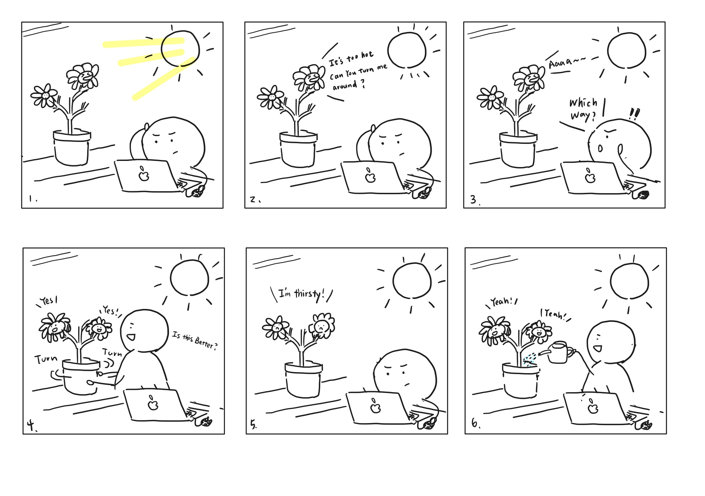
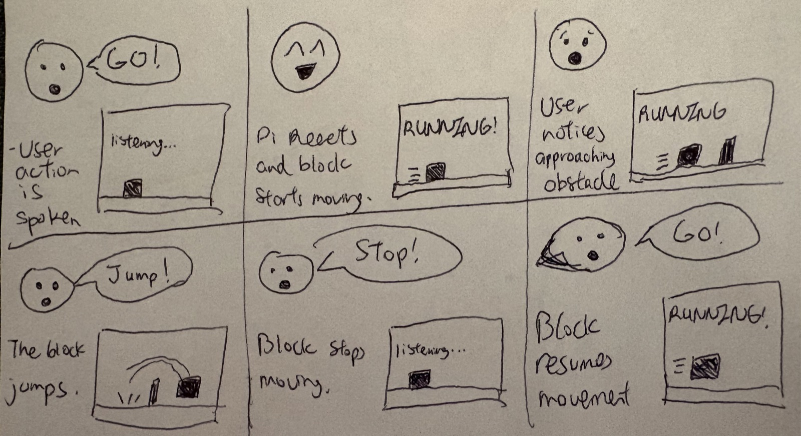

# Chatterboxes

**NAMES OF COLLABORATORS HERE**
Jacey Hu (ch2296), Edmond Kong (eck67), Gabriela Yaulli (cgy4)
[](https://youtu.be/LZ0VJClIlRI?si=Yy84mcyVYuVV19mn)

In this lab, we want you to design interaction with a speech-enabled device — something that listens and talks to you. This device can do anything *but* control lights (since we already did that in Lab 1). First, we want you to storyboard what you imagine the conversational interaction to be like. Then you will use wizarding techniques to elicit examples of what people might say, ask, or respond. We then want you to use the examples collected from at least two other people to inform the redesign of the device.

We will focus on **audio** as the main modality for interaction to start; these general techniques can be extended to **video**, **haptics** or other interactive mechanisms in the second part of the Lab.

A note on what you are building with. Speech interfaces are usually taught as two boxes — speech-in, speech-out — and that framing hides the part that actually determines whether an interaction works. Between listening and speaking sits the question of **whose turn it is**: when does the device decide you have finished talking, and how long does it make you wait before it answers? This lab gives you direct control over both, and we will ask you to notice what changes when you move them.

## Prep for Part 1: Get the Latest Content and Pick up Additional Parts

Please check instructions in [prep.md](prep.md) and complete the setup.

### Pick up Web Camera If You Don't Have One

Students who have not already received a web camera will receive their Webcam and at the beginning of lab. If you cannot make it to class this week, please contact the TAs to ensure you get these.

### Get the Latest Content

As always, pull updates from the class Interactive-Lab-Hub to both your Pi and your own GitHub repo.

**\[recommended\]** Option 1: On the Pi, `cd` to your `Interactive-Lab-Hub`, pull the updates from upstream (class lab-hub) and push the updates back to your own GitHub repo. You will need the *personal access token* for this.

```
pi@ixe00:~$ cd Interactive-Lab-Hub
pi@ixe00:~/Interactive-Lab-Hub $ git pull upstream Fall2026
pi@ixe00:~/Interactive-Lab-Hub $ git add .
pi@ixe00:~/Interactive-Lab-Hub $ git commit -m "get lab3 updates"
pi@ixe00:~/Interactive-Lab-Hub $ git push
```

Option 2: On your own GitHub repo, create a pull request to get updates from the class Interactive-Lab-Hub. After you have the latest updates online, go to your Pi, `cd` to your `Interactive-Lab-Hub` and use `git pull`.

---

# Part 1

## Setup

Create and activate a virtual environment for this lab:

```
pi@ixe00:~$ cd Interactive-Lab-Hub/Lab\ 3
pi@ixe00:~/Interactive-Lab-Hub/Lab 3 $ python3 -m venv .venv
pi@ixe00:~/Interactive-Lab-Hub/Lab 3 $ source .venv/bin/activate
(.venv) pi@ixe00:~/Interactive-Lab-Hub/Lab 3 $
```

Install the Python dependencies:

```
(.venv) $ pip install -r requirements.txt
```

This takes a few minutes. If you would like it to take considerably less time, [`uv`](https://docs.astral.sh/uv/) is a drop-in replacement for `pip` that is dramatically faster on the Pi:

```
(.venv) $ pip install uv && uv pip install -r requirements.txt
```

Then run the setup script, which installs the classic speech synthesizers, downloads the voice activity detection model, and pre-fetches a neural voice and a speech recognition model so you are not waiting on downloads during lab:

```
(.venv):~$ cd speech-scripts
(.venv) $ ./setup.sh
```

Check your audio devices before going further. `arecord -l` lists capture devices and `aplay -l` lists playback devices; if your webcam microphone or Bluetooth speaker does not appear, fix that first — every script below assumes the system defaults are the ones you want.

## A. Text to Speech

Your Pi can speak in several quite different ways, and the differences are audible in a way that matters for design. In `speech-scripts/` there are shell scripts for each.

### The classic engines

```
(.venv) $ cd speech-scripts

(.venv) $ sudo apt update
(.venv) $ sudo apt install -y espeak festival festvox-kallpc16k

(.venv) $ ./espeak_demo.sh
(.venv) $ ./festival_demo.sh
```

You can run these `.sh` files by typing `./filename`, and read one with `cat filename`. You can also play audio files directly with `aplay filename` — try `aplay lookdave.wav`.

These are all decades-old technology and they sound like it. `espeak-ng` is a *formant synthesizer*: it generates speech from an acoustic model of the vocal tract, which is why it sounds robotic but also why the whole thing fits in a couple of megabytes and responds instantly. `festival` is *concatenative*: they stitch together recorded fragments of a real speaker, which sounds more human but breaks audibly at the seams.

### Neural TTS with Piper

Note that the Piper command line changed in version 1.x — voices are now downloaded explicitly with `python3 -m piper.download_voices`, and you invoke it as `python3 -m piper`. Tutorials you find online may show the old `echo ... | piper --model ...` form, which no longer works. Browse the [voice samples](https://rhasspy.github.io/piper-samples) and download a different one if you'd like:

```
(.venv) $ python3 -m piper.download_voices en_US-lessac-medium
```

[Piper](https://github.com/OHF-Voice/piper1-gpl) synthesizes speech with a small neural network, runs comfortably on the Pi 5, and sounds markedly better than the above.

```
(.venv) $ ./piper_demo.sh
```

The demo script also shows `--output-raw`, which streams audio to the speaker as it is generated rather than writing a file first. Listen for the difference in how quickly speech begins. In a conversational system this gap is the thing your user experiences as responsiveness.

\*\***Write your own shell file to use your favorite of these TTS engines to have your Pi greet you by name.**\*\*
(This shell file should be saved to your own repo for this lab.)

\*\***Then answer: Is the same greeting, in these different voices, the same greeting? Describe one concrete way the voice changed what the utterance seemed to mean or who seemed to be speaking.**\*\*

The words were exactly the same, but they didn't feel like the same greeting. Piper (my greet.sh) sounded the most like a real person, and it was the most comfortable to listen to. It felt like someone was actually want to welcoming me. espeak was clearly a robot, but it wasn't bad. It sounded more like a system notification than a greeting. Festival was the strangest. It had almost no pitch change, so it sounded like a cartoon robot.

## B. Speech to Text

We use [faster-whisper](https://github.com/SYSTRAN/faster-whisper), a reimplementation of OpenAI's Whisper model that runs several times faster on CPU and does not require PyTorch. All processing happens on the Pi; nothing is sent to a server.

```
(.venv) $ python transcribe.py lookdave.wav
```

The transcript is not the interesting output here — the timings are. Run it again with a larger model and compare:

```
(.venv) $ python transcribe.py lookdave.wav --model base.en
(.venv) $ python transcribe.py lookdave.wav --model small.en
#  noted that the first run may take longer because the model is downloaded, and that the HF unauthenticated-request warning is expected and not an error.
```

Available sizes, smallest first: `tiny.en`, `base.en`, `small.en`, `medium.en`. The `.en` variants are English-only and faster than their multilingual counterparts at the same size.

\*\***Record a few seconds of your own speech (`arecord -d 5 -f cd -c 1 -r 16000 test.wav`) and transcribe it with at least two model sizes. Report the real-time factor for each. At what point does the accuracy improvement stop being worth the delay, for a system that has to answer you?**\*\*
I recorded myself saying "I have 16 pieces of fried chicken for dinner." The recording was 7 seconds. Then I tried three model sizes.

| Model | Transcript | Transcription time | Real-time factor |
|---|---|---|---|
| tiny.en | I have 16 pizzas for chicken for dinner. | 1.06s | 0.15x |
| base.en | I have 16 pieces fried chicken for dinner. | 1.95s | 0.28x |
| small.en | I have 16 pieces fried chicken for dinner. | 5.65s | 0.81x |

tiny.en was the fastest, but it got some words wrong. It heard "pieces fried" as "pizzas for," so now I have 16 pizzas. base.en and small.en both got it right, and their results were the same. But small.en was almost 3 times slower.

I think base.en is the best choice. It fixed tiny's mistake and only took about 1 second more. small.en was not more accurate, it was just slower. 

\*\***Write your own script that verbally asks for a numerical input (a phone number, zipcode, number of pets) and records the answer the respondent provides.**\*\* Numbers are a good stress test — transcription systems make characteristic errors on digit strings, and you will want to know what they are before you design around them.  

My script `ask_zip.py` asks "What is your five digit zip code?" with Piper, records 5 seconds, transcribes it with base.en, and pulls out the digits. Then it says the zip code back to me and saves the result to `zip_answers.csv`.

I tried it four times and said the number in different ways.

| Try | What I said | Transcript | Digits | Result |
|---|---|---|---|---|
| 1 | 10005 (a wrong zip on purpose) | 1,000,5. | 10005 | Accepted |
| 2 | 1004 (only 4 digits on purpose) | 1.0.0.4. | 1004 | Rejected |
| 3 | one oh oh four four | 1 0 0 4 it 4 | 10044 | Accepted |
| 4 | one zero zero four four | 1, 0, 0, 4, 4. | 10044 | Accepted |

The model heard the right digits every time. The problem was the format. The same kind of answer came back with commas, periods, or spaces. In try 1 it wrote "1,000,5" like a big number. So I can't use the transcript directly. My script has to pick out the digits first.

Saying "oh" instead of "zero" also worked, but in try 3 the model added a random word "it." "Zero" was cleaner.

The length check caught try 2 because it only had 4 digits. But it can't catch try 1. 10005 looks like a real zip code, it's just not mine. The script has no way to know that. That's why it reads the number back, so the person can hear it and fix it.
## C. Turn-taking: knowing when someone has stopped talking

Everything so far has worked on fixed audio files. A real conversational device does not get told when to start and stop recording — it has to decide. This is the problem that makes speech interfaces hard, and it is mostly not a speech recognition problem.

We use a **voice activity detector** (VAD) to segment the microphone stream into utterances. `listen.py` runs Silero VAD continuously and hands each detected utterance to faster-whisper:

```
(.venv) $ cd speech-scripts
(.venv) $ python listen.py
```

Speak, pause, and watch it transcribe. Now change the endpointing threshold — the amount of silence the system requires before it decides your turn is over:

```
(.venv) $ python listen.py --min-silence 0.2
(.venv) $ python listen.py --min-silence 1.5
```

\*\***Try both extremes, and something in between. Describe what each one feels like to talk to. Note specifically: at 0.2s, what kinds of normal speech get cut off? At 1.5s, what does the delay make the system seem like?**\*\*

There is no correct value. A system that takes drink orders and a system that listens to someone think out loud want very different thresholds, and the right one depends on what your users are doing with their pauses.  

I said the same three things each time: "I'd like a large coffee... um... with oat milk," "My phone number is 917... 555... 0123," and "Yes." I paused where the dots are.

**0.2s:** It felt very impatient. It cut me off every time I took a breath or paused a little. "A large coffee with oat milk" became "have light and light coffee" and "We saw milk." My phone number got split into pieces, and "555" came out as "Bye, bye, bye." Short answers like "Yes" were fine.

**0.4s (default):** Still cut me off at the "um." "Oat milk" became "Oh, muke," and "555" became "Bye" again.

**0.7s:** A little better, but it still split my sentences at the pauses.

**1.5s:** It felt patient, like it was really waiting for me to finish. It got the full coffee order right except "old milk." But it also put my coffee order and my phone number together as one long turn. It couldn't tell the difference between me pausing to think and me being done.

The biggest thing I noticed is that cutting speech into small pieces also made the transcripts worse. When the model heard the whole sentence, it had more context and made fewer mistakes. When "555" was by itself, it didn't know it was part of a phone number, so it guessed "Bye." So the silence setting doesn't just change how the device feels. It changes what the device understands.

### The complete loop

`echo_bot.py` puts the pieces together: it listens, endpoints, transcribes, and speaks a reply through Piper. The dialogue policy is deliberately trivial — it repeats what you said — so that everything you notice is a property of the timing rather than the content.

```
(.venv) $ python echo_bot.py
```

## D. Storyboard

Storyboard and/or use a Verplank diagram to design a speech-enabled device. (Stuck? Make a device that talks for dogs. If that is too stupid, find an application that is better than that.)
\*\***Post your storyboard and diagram here.**\*\*




Write out what you imagine the dialogue to be. Use cards, post-its, or whatever method helps you develop alternatives or group responses.
**Dialogue script**

**Dialogue script (main path)**

| # | Speaker | Line | Device wait before responding |
|---|---|---|---|
| 1 | Device | It's too hot over here. Can you turn me around? | (unprompted, triggered by light sensor) |
| 2 | Device | Aaaaaa... | 2s after line 1, if no one responds |
| 3 | User | (notices) Which way? | — |
| 4 | Device | (silent. It doesn't know.) | — |
| 5 | User | (turns the pot) Is this better? | — |
| 6 | Device | Yes! Much better. | 0.4s |
| 7 | Device | ...I'm also kind of thirsty. | 1.2s after line 6 |
| 8 | User | (pours water) | — |
| 9 | Device | Yeah! Thank you. | 0.4s, triggered by moisture sensor |

\*\***Please describe and document your process.**\*\*

My first idea was a talking fridge. It would warn you about food that is going bad, but in a rude way, like "your apple is stinky" or "your soup sucks." It could also tell a dad joke when you put vegetables in. I liked that it had a personality, but it was mostly a joke machine. The fridge didn't really need to talk to do its job.  

Then I thought about a plant. I am a plant killer. My plants die because they can't talk, so I forget they exist. A plant that can ask for things is more useful than a fridge that makes fun of me, and the interaction is the opposite of a normal assistant. 

I only made one version of the storyboard. I thought about the scene in my head and then drew it directly. Writing the dialogue out afterwards is where I found the problems.  

The first thing I noticed is that I skipped a line. In my storyboard the plant asks to be turned around, the user asks "Which way?", and then the user is already turning the pot. The plant never answers. At first I thought this was just a mistake in my drawing, but then I realized the plant doesn't know the answer. It only has a light sensor. It knows one side is too bright, not that the window is on the left. The user has to guess and try turning it, and the plant only reacts once the light changes. That turned the interaction into guessing game instead of a command.  

The second thing is the timing. I set most of the pauses to 0.4s because that is the default, but from Part C I know 0.4s cuts me off whenever I say "um" or stop to think. In this script the user is doing something physical between lines, turning the pot or pouring water, so they will pause a lot. 0.4s is too short for that. 

Your script should include the pauses. Where does your device wait, and for how long? You now know from Part C that this is a parameter you have to choose, not something that happens for free.

## E. Acting out the dialogue

Find a partner, and *without sharing the script with your partner* try out the dialogue you've designed, where you (as the device designer) act as the device you are designing. Please record this interaction (for example, using Zoom's record feature).

\*\***Describe if the dialogue seemed different than what you imagined when it was acted out, and how.**\*\*


When the plant said "can you turn me around," my partner's first reaction was to ask which way she should turn it. I planned for this in Part D. I made the plant stay silent there because it only has a light sensor, so it really doesn't know where the window is. On paper that felt honest. In the room it just felt broken. She asked and then waited, and the silence didn't tell her anything. She thought the device was not working.

Then she started turning the plant, but she didn't know if that was right. My script has the plant say "Yes! Much better" only after she finishes turning. But she stopped in the middle and looked at me, because nothing happened. The reaction needs to be more immediate. She needs to hear something while she is turning, not after.

Watering was the same problem. She poured the water, and she didn't know when to stop. The plant only says "Yeah! Thank you" at the end, so there was a long part where she was just pouring and waiting. She kept looking at me to check. A plant that can't say "that's enough" is a plant you can drown.


[Recording of Part E](https://drive.google.com/file/d/1Vt6QaTxvsfqUOJ7nFwvdDO3Uu-Ml0Pdp/view?usp=drive_link)


---

# Lab 3 Part 2

## Prep for Part 2

1. What are concrete things that could use improvement in the design of your device? For example: wording, timing, anticipation of misunderstandings.
2. What are other modes of interaction *beyond speech* that you might also use to clarify how to interact? In particular: how does someone know when the device is listening, and when it is thinking? You have a screen and an LED.
3. Make a new storyboard, diagram and/or script based on these reflections.
4. (optional) Integrate [input devices](inputs.md) in the system



## Prototype your system

`voice_runner.py` puts a character on the Mini PiTFT that you control with your
voice. The only sensor is the microphone. The screen is the only output and there
is no speech back, because the thing we wanted to fix from Part 1 was that the
user could not tell what the device had understood, and a reply she has to
wait for does not solve that.

The microphone is read once, in 20ms frames, and each frame feeds **two paths
that run at completely different speeds.**

| | metric | control | lag |
|---|---|---|---|
| fast | loudness (RMS), and onset (normalized spectral flux) | jump | ~30ms |
| slow | Silero VAD → faster-whisper `tiny.en` | "go", "stop", "jump" | ~1.5s |

The fast path does no recognition at all. It compares each frame's loudness to a
noise floor measured during the first second, and separately asks how much of
the frame's spectrum is *new* relative to the frame before it. A clap puts
energy into every frequency bin at once, so that fraction jumps near 1 and a vowel
you are already holding scores near 0 no matter how loud it is. Dividing by the
frame's own magnitude is what lets one fixed threshold work whether you are
close to the mic or across the room.

The slow path is the Part 1 stack reused: Silero VAD decides when an utterance
has ended, faster-whisper transcribes it, and the result is matched against
whole words. It runs on its own thread, because a transcription takes about a
second and doing it inline would freeze the animation for thirty frames. Both
paths share one audio stream. Opening a second one on the same capture device
fails on the Pi.

Speech recognition cannot move the character. During testing,
we saw 0.4s of capture plus roughly a second of transcription.
That is fifty times slower than the fast path, and it is not a tuning problem.
the capture wait exists precisely so the system can be sure you have
stopped talking. So motion rides the fast path and state changes ride the slow
one.

**"go" phrase triggers the movement until directed otherwise.** Saying "stop" is itself a sound. If loudness
drove the running, the word "stop" would re-trigger the gate at the same instant
it was supposed to halt the character. So "go" turns running on until "stop"
turns it off, rather than the character running only while noise is present.
The original design had the user keep humming and moving the character as any
speech is recognized. But we quickly realized that this is not a very user-friendly
design.— it is a consequence of adding "stop", and I
only noticed it once I tried to write the command list down.

**What the screen shows.** Three states — `listening`, `thinking...`,
`RUNNING` — plus a live input meter with a notch marking the gate the sound has
to clear, and the last command it recognised with how long that took
(`heard "go" 1.4s ago`). The meter and the notch together help the user figure out
why the system does not react to it. If they were too quiet or the audio was unheard,
they can troubleshoot this as they try do troubleshoot.This is the part that 
is a direct response to Part 1, where
silence from the device was indistinguishable from the device being broken.

*Include videos or screencaptures of both the system and the controller.*

[**Demo video**](demovideo.mp4) — `voice_runner.py` running on the Pi. The screen
shows the character and the live input meter; the terminal shows each command as
it is recognised, with the lag it took to get there.

## Test the system

### What worked well about the system and what didn't?
The display int he Rasperry pi worked well and the animation was smooth. The moving bar at the top of the screen that measures audio strength
was also working as intended. The users could also tell the state in which the device was in, giving them clues of what actions they might need to do. 
For example, if the device says "listening", they know it is waiting for a command to start it. Another thing that went well was that the users 
instinctively wanted to make the block jump as an obstacle gets closer.

However, the speech recognition could use some tuning. The "stop" command is hard to get right and users often had to repeat it several times. There
is no direct feedback that tells the user whether or not the spoken command is actually valid, so they have to keep saying it. Or maybe if the system
is already processing a "stop" command, it will take it a little too long to do so. So someone would have to react really quickly to an incoming obstacle
otherwise they will crash into it.

### What worked well about the controller and what didn't?
Initially, we thought that the three commands of "go", "stop", and "jump" were simple enough. The commands were easy to explain, though some users
actually tried words that weren't in the intstruction set such as "move", "no", and "faster". We also saw some users concentrate too much on the noise
meter instead of the moving block, which led them to crash into obstacles. The noise meter clearly reacts to voice commands so people sometimes would
crash into incoming obstacles because they are focused on reading and reacting to the noise meter.

### What lessons can you take away from the WoZ interactions for designing a more autonomous version of the system?
There should be a clear indication of what the user can do or say to interact with the system. In other words, the intended
purpose should be self-explanatory so that a user can use their intuition to perform an action. A good feedback system is essential
because it helps correct unintended behavior. But a feedback system can also raise false positives if we are not careful when tuning it.

### How could you use your system to create a dataset of interaction? What other sensing modalities would make sense to capture?
The script already hears everything, so it can save a line every time someone talks: what they said, whether it matched one of the three commands, and how long it took. Two things in that log would be useful. First, the words people tried that aren't in the instruction set. This would tell us what are some frequent commands to add. Second, how often someone says the same thing twice, because that is the moment they stopped believing the device heard them. We can also save the sound itself, so afterwards we can check whether the device misheard the word or if it failed to register for some other reason.

For other sensors, a proximity sensor could catch people leaning in closer, which is what they do when they think it missed them. A camera would show whether anyone actually looks at the screen while it says "thinking." And we could log what the screen was showing at each moment and what the device was saying right before the person reacted. Latency and response are two important metrics that can judge the system's performance and accuracy.
